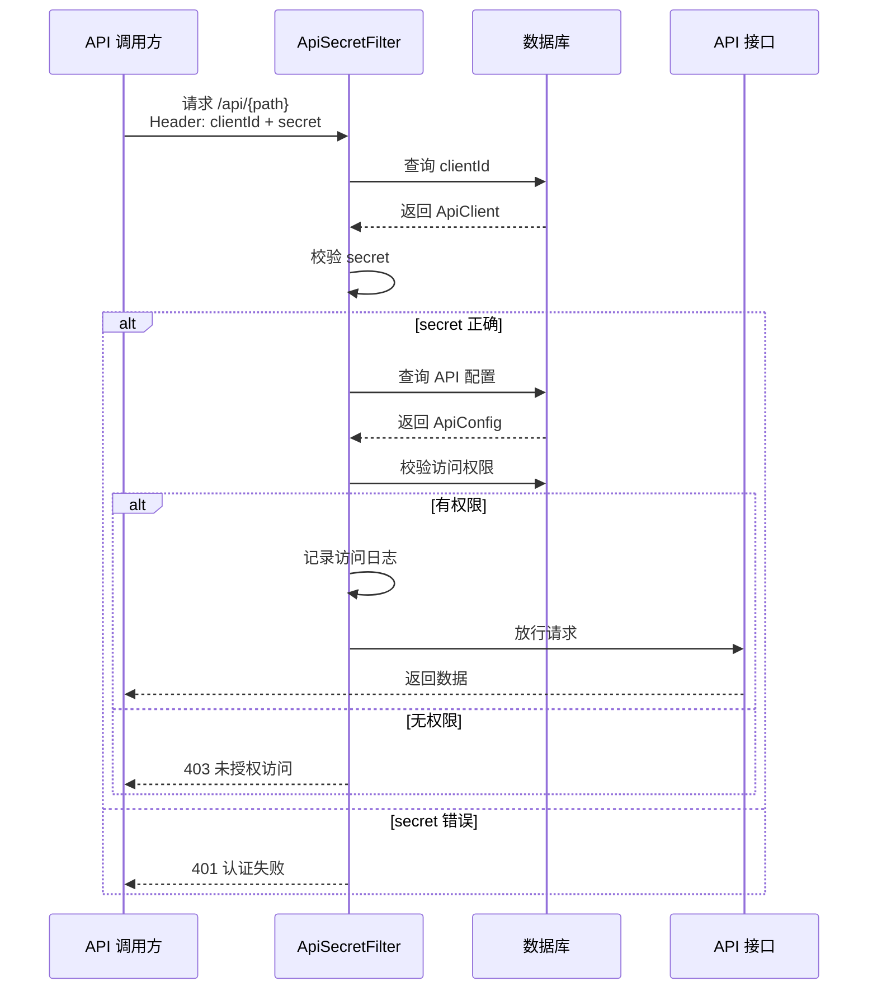

# 客户端管理

客户端（Client）代表一个 API 调用方。每个客户端有唯一的 `clientId` 和 `secret`，用于 API 调用的身份认证。

## 客户端实体

```java
@Entity
@Table(name = "api_client")
public class ApiClient {
    @Id
    @GeneratedValue(strategy = GenerationType.UUID)
    private String id;        // UUID 主键
    private String clientId;  // 客户端ID（唯一标识）
    private String name;      // 客户端名称
    private String secret;    // 客户端密钥
    private String note;      // 备注
    private String accountId; // 所属账号
}
```

## 鉴权流程



## API 接口

### 查询客户端列表

```http
GET /apiClient/search?pageNum=0&pageSize=20&name=<关键字>
```

### 创建客户端

```http
POST /apiClient/add
Content-Type: application/json

{
  "name": "数据大屏",
  "note": "用于数据大屏展示的API调用"
}
```

创建成功后返回完整的客户端信息，包含自动生成的 `clientId` 和 `secret`。

### 查看客户端详情

```http
GET /apiClient/detail/{id}
```

### 更新客户端

```http
POST /apiClient/update
Content-Type: application/json

{
  "id": "<客户端ID>",
  "name": "数据大屏（新版）",
  "note": "更新后的备注"
}
```

### 删除客户端

```http
GET /apiClient/delete/{id}
```

::: danger 注意
`clientId` 和 `secret` 由系统自动生成，不可手动修改。删除客户端前请确认没有业务系统在使用该客户端的凭证。
:::

## 安全建议

1. **Secret 保密**：`secret` 应妥善保管，不要在代码仓库中明文存储
2. **最小权限**：为每个客户端仅授权其需要访问的 API
3. **定期轮换**：定期更换客户端密钥
4. **HTTPS**：生产环境务必使用 HTTPS 传输，避免凭证泄露
