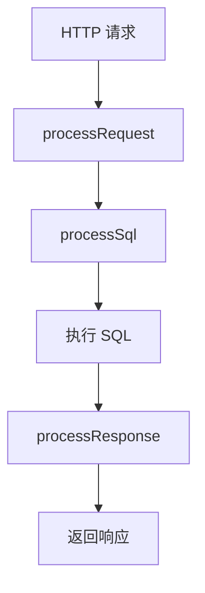

# 插件系统

插件系统是玉衡API的扩展机制，允许在 API 请求处理的各个阶段插入自定义逻辑。

## 插件接口

```java
public interface Plugin {
    /** 插件名称 */
    String getName();

    /** 插件描述 */
    String getDescription();

    /** 初始化（API 配置加载时调用） */
    void init(ApiConfig apiConfig);

    /** 处理请求参数 */
    Map<String, Object> processRequest(HttpServletRequest request, Map<String, Object> params);

    /** 处理响应数据 */
    Object processResponse(Object response);

    /** 处理 SQL 语句 */
    ApiSql processSql(ApiSql apiSql, Map<String, Object> params, String databaseType);
}
```

## 处理流程



插件的三个处理阶段：

| 阶段              | 方法               | 说明                       |
| ----------------- | ------------------ | -------------------------- |
| 请求预处理        | `processRequest`   | 在 SQL 执行前处理请求参数   |
| SQL 处理          | `processSql`       | 在 SQL 执行前修改 SQL 语句  |
| 响应后处理        | `processResponse`  | 在 SQL 执行后处理返回数据   |

## 内置插件：分页插件

`PaginationPlugin` 是内置的分页插件，自动为 API 添加分页功能。

### 参数说明

| 参数       | 默认值 | 最大值 | 说明         |
| ---------- | ------ | ------ | ------------ |
| `page`     | 1      | -      | 页码（从1开始）|
| `pageSize` | 20     | 100    | 每页记录数    |

### MySQL 分页

```sql
-- 原始 SQL
SELECT * FROM person WHERE dept = ? 

-- 分页处理后
SELECT * FROM person WHERE dept = ? LIMIT ? OFFSET ?
```

### Oracle 分页

```sql
-- 原始 SQL
SELECT * FROM person WHERE dept = ? 

-- 分页处理后
SELECT * FROM (
  SELECT t.*, ROWNUM as IGNORE_RN FROM (
    SELECT * FROM person WHERE dept = ? 
  ) t WHERE ROWNUM <= ?
) WHERE IGNORE_RN >= ?
```

### 分页响应

使用分页插件后，响应会包含 `pageInfo` 字段：

```json
{
  "code": 200,
  "message": "操作成功",
  "data": [ /* 当前页数据 */ ],
  "pageInfo": {
    "pageNum": 1,
    "pageSize": 20,
    "total": 150
  },
  "timestamp": 1700000000000
}
```

## 自定义插件

实现 `Plugin` 接口即可创建自定义插件：

```java
public class MyCustomPlugin implements Plugin {

    @Override
    public String getName() {
        return "自定义插件";
    }

    @Override
    public String getDescription() {
        return "在响应中添加自定义字段";
    }

    @Override
    public void init(ApiConfig apiConfig) {
        // 初始化逻辑
    }

    @Override
    public Map<String, Object> processRequest(HttpServletRequest request, Map<String, Object> params) {
        // 添加自定义参数
        params.put("_timestamp", System.currentTimeMillis());
        return params;
    }

    @Override
    public ApiSql processSql(ApiSql apiSql, Map<String, Object> params, String databaseType) {
        // 不修改 SQL
        return apiSql;
    }

    @Override
    public Object processResponse(Object response) {
        // 包装响应数据
        if (response instanceof List) {
            Map<String, Object> wrapper = new HashMap<>();
            wrapper.put("list", response);
            wrapper.put("count", ((List<?>) response).size());
            return wrapper;
        }
        return response;
    }
}
```

## 插件管理 API

### 查询插件列表

```http
GET /apiPlugin/search
```

### 创建插件

```http
POST /apiPlugin/add
Content-Type: application/json

{
  "name": "分页插件",
  "className": "com.compass.yuhengapi.plugin.impl.PaginationPlugin",
  "note": "为API添加分页功能"
}
```

### 删除插件

```http
GET /apiPlugin/delete/{id}
```
