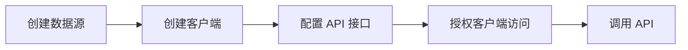

## 核心流程

## 技术栈

| 类别       | 技术                                      |
| ---------- | ----------------------------------------- |
| 框架       | Spring Boot 4.0 + Spring Security         |
| ORM        | Spring Data JPA + Hibernate               |
| 数据库     | MySQL / Oracle                            |
| 连接池     | Druid                                     |
| 缓存       | Caffeine + Redis                          |
| 限流熔断   | Resilience4j                              |
| SQL 解析   | JSqlParser                                |
| JSON       | Fastjson2                                 |
| 工具库     | Hutool, Apache Commons, MapStruct         |
| Excel      | Apache POI                               |
| 模板引擎   | Thymeleaf                                 |
| 原生编译   | GraalVM Native Image                      |
